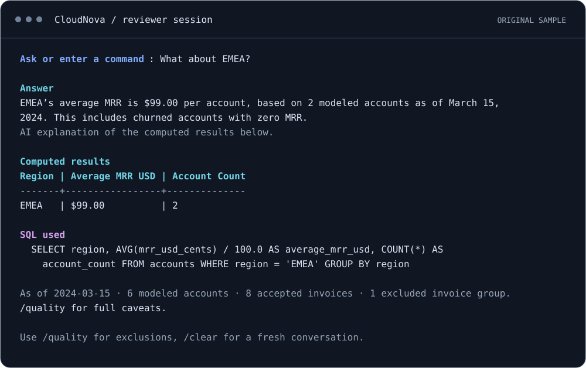
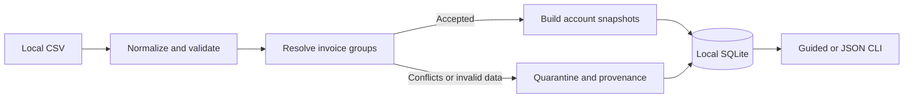
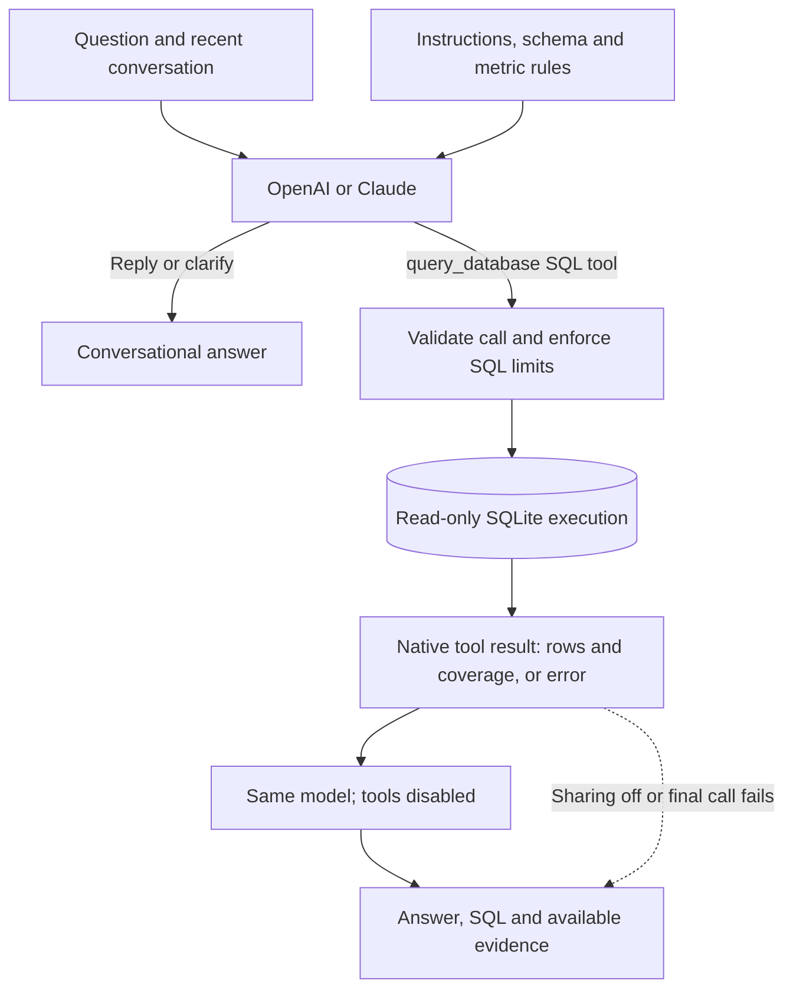

# CloudNova Query Agent

**Turn messy invoices into answers you can trace.**

A Python invoice pipeline and conversational SQL agent. Clean the ledger, ask a question, follow up naturally, and inspect the computed evidence behind the answer.

[](#quick-start)
[](#app-architecture)
[](#quick-start)
[](#verification)

[Quick start](#quick-start) · [CLI preview](#a-conversation-with-evidence) · [Architecture](#architecture) · [Verification](#verification) · [Reviewer guide](docs/REVIEWER_GUIDE.md)

## Quick start

```bash
git clone https://github.com/fahmidme/cloudnova-query-agent.git
cd cloudnova-query-agent
python3 run.py
```

**Prerequisite:** Python 3.11+ with `venv` and `sqlite3`. On Windows, use `py -3 run.py`; if your Python command is `python`, use `python run.py`.

One command creates an isolated `.venv` and guides you through:

1. **Load data** — use the bundled sample or enter a local CSV path.
2. **Inspect quality and answers** — see exclusions, an offline SQL example, and the independent tests.
3. **Start a conversation** — choose OpenAI or Claude, accept or edit the model, and enter your key at the hidden prompt.

The offline tour needs **no API key, package downloads, Docker, or database server**. Live questions need internet and a funded API account. Saved keys are reused through the OS credential store when available; there is no plaintext storage fallback. [Setup details →](docs/REVIEWER_GUIDE.md)

## A conversation, with evidence

After asking which region has the highest average MRR, follow up with **“What about EMEA?”**



<sub>Rendered with the app's CLI formatter. Answer wording comes from the recorded OpenAI smoke check; SQL results are recomputed from the original sample. [Plain-text version](docs/assets/cli-preview.txt) · [Reproduce the preview](docs/assets/README.md)</sub>

Try these next:

| Ask | Explore |
| --- | --- |
| “What kinds of questions can you help me answer?” | Capabilities, explained conversationally |
| “What is paid invoice revenue for 2024?” | **$2,710** on the sample |
| “Show refunds and net revenue.” | **$49** refunded; **$2,661** net on the sample |
| “What was Enterprise churn during February 2024?” | An explanation of the missing churn events and opening cohort |

These are sample expectations, not supplied-ledger results. The agent interprets questions using the schema and metric rules; examples are not a runtime answer lookup.

<details>
<summary><strong>Useful session commands</strong></summary>

| Command | Purpose |
| --- | --- |
| `/examples` · `/quality` | Explore offline SQL examples and data-quality findings |
| `/inspect I9` | Trace the sample's conflicting invoice back to its source rows |
| `/clear` | Start a fresh conversation |
| `/summary` | Toggle sending computed rows back to the model |
| `/provider` · `/key` · `/forget` | Switch providers, replace a saved key, or remove it |
| `/evaluate` | Offer seven live SQL checks with a paid-call confirmation |
| `/quit` | End the session |

Color follows terminal support. Set `NO_COLOR=1` for plain output; redirected output and JSON commands remain plain automatically.

</details>

## Choose your model

| Provider | Editable default | Get a key |
| --- | --- | --- |
| OpenAI | `gpt-5.6-luna` | [OpenAI API keys](https://platform.openai.com/api-keys) |
| Claude | `claude-haiku-4-5-20251001` | [Claude API keys](https://platform.claude.com/settings/keys) |

Press Enter to accept the selected model. A ChatGPT or Claude chat subscription is separate from API billing. The [reviewer guide](docs/REVIEWER_GUIDE.md#models-and-api-keys) has exact billing/key steps, dated pricing references, secure-storage requirements, and environment configuration.

## Architecture

### App architecture



The pipeline preserves source rows, collapses equivalent copies, and sets conflicting invoices aside. SQLite holds accepted invoices, provisional account snapshots, and local audit records. [Pipeline rules](specs/PIPELINE.md) · [Implementation](app/pipeline.py)

### Agent architecture



**One tool. At most one SQL attempt and two model calls per turn.** The model chooses when to query or converse. Python enforces the execution boundary; failed SQL stays a failed query. If the final model call fails, successful computed results remain visible. No automatic retries or agent framework.

- **Context:** up to three recent turns / 12 KB in session memory; `/clear` resets it.
- **Data sharing:** prompts, recent conversation and coverage go to the selected provider. Query rows, including any names/IDs, are sent back by default; `/summary` keeps new result rows local. Raw audit records and contact-email fields are excluded.
- **Guardrails bonus:** read-only connections, table/column/function allowlists, bounded execution and output, input checks, and escaped terminal controls. These constrain execution; they do not guarantee model accuracy.

[Edit the prompts](app/prompts.py) · [Read the agent loop](app/service.py) · [Inspect SQL safeguards](app/query.py) · [Full agent contract](specs/AGENT.md)

## Data decisions worth knowing

| Decision | Effect on answers |
| --- | --- |
| Conflicting invoices are quarantined | Report conditional financial uncertainty, not “lost revenue.” |
| Ambiguous dates need evidence | Infer when supported and flag the inference; quarantine unresolved required dates. |
| Latest accepted invoice supplies the account snapshot | MRR is provisional; churned accounts contribute zero. Snapshot churn is not period churn. |
| Recorded amounts × stated FX drive USD revenue | Keep paid revenue, refunds and net revenue distinct; flag pricing discrepancies. |

**Pending clarification:** account identity/snapshot precedence and recorded-amount/FX precedence. Both remain explicit provisional policies. The supplied assessment CSV stays outside this public repository; bring your local copy. [Detailed decisions and limits →](docs/REVIEWER_GUIDE.md#business-decisions-and-limitations)

## Verification

| Evidence | Recorded result |
| --- | --- |
| Offline suite | **54 checks passed** on Python 3.12.14 and 3.14.2 |
| Independent SQL expectations | **6/6 passed** against the original fixture |
| Live OpenAI regression | **7/7 passed** with GPT-5.6 Luna after two prompt corrections |
| Conversation smoke check | Capabilities, regional MRR, contextual EMEA follow-up, and missing-expense explanation |
| Fresh public clone | Setup, guided journey, tests and offline cases passed; zero third-party packages |

The badge reports recorded offline verification, not a CI run. Live checks use a small synthetic fixture; they are not a broad accuracy benchmark. **Claude live behavior and Windows/Linux execution remain unverified.** The [build log](docs/BUILD_LOG.md) preserves the initial failures and subsequent results.

```bash
# Run locally after setup; Windows: use .venv\Scripts\python.exe
.venv/bin/python -m unittest discover -s tests -v
.venv/bin/python -m app evaluate
```

For ingestion, JSON answers, manual SQL, provenance inspection, and the optional paid live regression, see [scriptable commands](docs/REVIEWER_GUIDE.md#scriptable-commands).

## Continue from here

[Reviewer guide](docs/REVIEWER_GUIDE.md) · [Specifications](specs/AGENT.md) · [Code map / handoff](docs/HANDOFF.md) · [Independent evaluation plan](specs/EVALUATION.md) · [Development prompt log](docs/PROMPT_LOG.md)

Next priorities: confirm the two business policies, expand live paraphrase/adversarial checks across providers, and verify Windows/Linux before adding CI across platforms.

<details>
<summary>Build process and timebox</summary>

Specifications and independent expectations preceded implementation. The first build checkpoint took approximately 54 minutes; the later owner-requested agent refactor added roughly 10–11 minutes. Preparation, research and this documentation polish are additional work. The complete project is not claimed to fit within one hour. See the chronological [build log](docs/BUILD_LOG.md).

</details>
