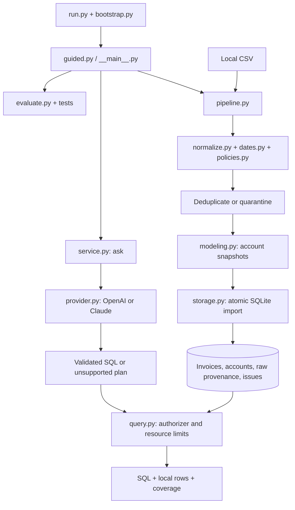

# CloudNova Query Agent

A spec-driven invoice pipeline and natural-language SQL agent. Ask a question, inspect the generated SQL, and see the locally computed answer with data-quality caveats.

**Python 3.11+ · SQLite · zero third-party runtime dependencies · OpenAI or Claude**

## Start the reviewer journey

Clone this repository, open its directory, and run:

```bash
git clone https://github.com/fahmidme/cloudnova-query-agent.git
cd cloudnova-query-agent
python3 run.py
```

On Windows, use `py -3 run.py` with Python 3.11 or newer. On systems where Python is named `python`, use `python run.py`.

The command creates `.venv` and walks you through:

1. **Choose data:** press Enter for the original sample, or enter the supplied assessment CSV's local path.
2. **Review quality:** see accepted records, duplicate handling, quarantined invoice groups, financial uncertainty, and provisional policies.
3. **Inspect an answer:** view a curated SQL example and its computed result.
4. **Run evaluations:** execute the independent offline test suite.
5. **Ask questions:** choose OpenAI or Claude, enter a model ID, and enter your API key at a hidden terminal prompt. The entered key stays in memory for this session and is not saved.

Use `/examples`, `/quality`, `/inspect INVOICE_ID`, `/provider`, and `/quit` during the session. `/evaluate` offers seven live answer checks using the session key after confirming the paid-call count. Each natural-language question is independent; include the period and metric rather than referring to an earlier answer.

The sample, pipeline, SQL examples, and offline evaluations work without internet or credentials after cloning. Live questions need internet and a funded provider API account with access to the model you select. A ChatGPT or Claude chat subscription alone is not an API key. Python must include its standard-library `venv` and `sqlite3` modules; no pip download, Docker, or database server is needed. The command does not install system software.

## What to try

- What is the paid invoice revenue for 2024 in USD?
- Which region has the highest average MRR per account, including churned accounts?
- Compare Enterprise and Starter snapshot churn rates.
- Show the top five accounts by net revenue with their CSAT risk flags.
- How many pending or failed invoices are there, and what is their total exposure?
- What was Enterprise churn during February 2024? **Expected unsupported:** invoices do not provide churn event dates or the opening cohort.

The original sample has **$2,710 paid revenue, $49 refunds, and $2,661 net revenue**. Its conflicting invoice group contributes an uncertain additional **$0–$490**. These are hand-calculated fixture expectations, not results from the supplied business ledger. See [evaluation specification](specs/EVALUATION.md).

## Scriptable commands

After setup, use `.venv/bin/python` below; on Windows use `.venv\Scripts\python.exe`.

```bash
# Offline, machine-readable demonstration
.venv/bin/python -m app demo

# Import a CSV; specify as-of if a historical snapshot is wanted
.venv/bin/python -m app ingest /path/to/cloudnova_invoices.csv --db work/cloudnova.sqlite
.venv/bin/python -m app ingest /path/to/cloudnova_invoices.csv --db work/earlier.sqlite --as-of 2024-12-31

# All unit/contract tests and the six independent SQL answer checks
.venv/bin/python -m unittest discover -s tests -v
.venv/bin/python -m app evaluate

# Live question: configuration below is required
.venv/bin/python -m app ask "What is paid revenue for 2024 in USD?" --db work/cloudnova.sqlite --provider openai

# Manual SQL and local provenance inspection
.venv/bin/python -m app sql "SELECT invoice_id, amount_usd_cents FROM invoices LIMIT 5" --db work/cloudnova.sqlite
.venv/bin/python -m app inspect INV-100630 --db work/cloudnova.sqlite

# Optional seven-call live regression set, using the original fixture
.venv/bin/python -m app evaluate --live --provider openai
```

`evaluate --live` makes up to seven paid requests and reports expected versus actual answers, SQL, timing, and pass/fail. It stops after a provider error. Its fixture expectations were specified independently before implementation; this small regression set is not a general accuracy benchmark. An evaluation failure returns a nonzero exit status.

### Optional persistent configuration

The guided journey requires no configuration-file editing. For scripted use, copy `.env.example` to `.env` and replace the values locally:

```dotenv
LLM_PROVIDER=openai
OPENAI_API_KEY=your-api-key
OPENAI_MODEL=your-model-id
```

For Claude, use `LLM_PROVIDER=anthropic`, `ANTHROPIC_API_KEY`, and `ANTHROPIC_MODEL`. Environment values override `.env`; `--provider` overrides the provider choice. Use an OpenAI model supporting Responses and Structured Outputs (for example `gpt-4o-mini`), or a Claude model supporting Messages tool use. Model access varies by account; no model is silently substituted. Adapter contracts follow [OpenAI Structured Outputs](https://developers.openai.com/api/docs/guides/structured-outputs) and [Anthropic Messages](https://platform.claude.com/docs/en/api/http/messages/create). `.env` is ignored by Git. Keys are never printed or included in generated artifacts.

## Architecture and code trail



The provider receives the question, allowed schema, metric rules, and as-of date. It generates a plan; SQLite computes the answer. Invoice data, contacts, and results are not sent back to the provider. Text you include in your question is sent. There is one provider call per question and no second summarization call.

| Start here | Purpose |
| --- | --- |
| [Pipeline specification](specs/PIPELINE.md) | Schema, date inference, duplicates, FX, revenue, MRR, account snapshots |
| [Query specification](specs/QUERY.md) | Provider contracts, SQL safety, command behavior |
| [Evaluation specification](specs/EVALUATION.md) | Original fixture and independently calculated expectations |
| [Agent instructions](AGENTS.md) | Read order, code conventions, verification and continuity |
| [Handoff](docs/HANDOFF.md) | Verified state, unresolved decisions, next concrete work |
| [Build log](docs/BUILD_LOG.md) | Actual milestones, checks, and timebox accounting |
| [Selected prompt log](docs/PROMPT_LOG.md) | Clearly labeled, trimmed reconstruction of development direction |

## Business decisions and limitations

- **Conflicting invoices:** quarantine the whole invoice group. Keep alternatives and source rows; report conditional financial bounds. Unknown amounts/signs prevent a complete bound.
- **Dates:** infer only from exclusive column/format evidence or resolved paired chronology, and flag every inference. The default snapshot date is the maximum accepted invoice date, which may be future-dated in synthetic data. It is not a claim about today's business.
- **Revenue:** recorded local amounts × stated FX, rounded per invoice to integer USD cents. Paid, refunded, and net revenue are distinct. Price discrepancies are flagged.
- **MRR and churn:** one provisional latest-invoice snapshot per account. MRR uses plan price × seats × discount, including annual contracts; churned accounts contribute zero MRR. Regional means include those zero accounts. Churn is a snapshot ratio, not period churn.
- **Pending clarification:** account identity/latest-invoice precedence and recorded-amount/FX precedence. The implementation labels both policies provisional.
- **SQL hardening:** read-only connections; allowed tables, columns and functions; denied writes, raw/contact access, recursive queries and extensions; bounded SQL work and output. This constrains execution, not semantic correctness. A safe query can still answer the wrong question.
- **Data and scale:** the full supplied CSV is not in this public repo. Use your local copy. Imports are bounded to 20 MB and store sensitive raw provenance locally. This is a take-home CLI, not a deployed multiuser service.

## Verification and next day

Verified locally: 32 offline tests on Python **3.12.14 and 3.14.2**, six independent SQL answer cases, the 5,125-record supplied-data import, and terminal provider/key selection. Live provider behavior is **not yet verified with real credentials**. Windows/Linux execution is not yet verified. A fresh public clone also passed the guided journey, tests, demo, and answer checks in a new Python 3.12 venv with no third-party packages. See the build log for exact evidence.

With another day: obtain answers to the two business-policy questions, run and expand live paraphrase/adversarial evaluations across both providers, add CI across operating systems, and strengthen source-format contracts. Add UI/cloud infrastructure only when the delivery context calls for it.
