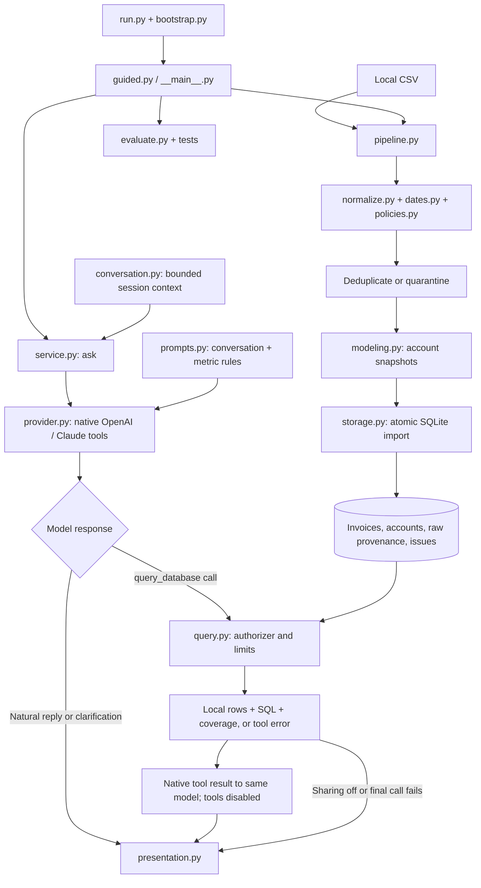

# CloudNova Query Agent

A spec-driven invoice pipeline with a small conversational agent. Ask naturally, follow up, and inspect the read-only SQL and computed evidence behind data answers.

**Python 3.11+ · SQLite · zero third-party runtime dependencies · OpenAI or Claude**

## Start the reviewer journey

Clone this repository, open its directory, and run:

```bash
git clone https://github.com/fahmidme/cloudnova-query-agent.git
cd cloudnova-query-agent
python3 run.py
```

On Windows, use `py -3 run.py` with Python 3.11 or newer. On systems where Python is named `python`, use `python run.py`.

The command creates `.venv` and walks you through:

1. **Choose data:** press Enter for the original sample, or enter the supplied assessment CSV's local path.
2. **Review quality:** see accepted records, duplicate handling, quarantined invoice groups, financial uncertainty, and provisional policies.
3. **Inspect an answer:** view a curated SQL example and its computed result.
4. **Run evaluations:** execute the independent offline test suite.
5. **Ask questions:** choose OpenAI or Claude, press Enter for the selected model (or type another ID), and enter your API key at a hidden terminal prompt. Newly entered keys are saved in the OS credential store and reused automatically on later runs.

Use `/examples`, `/quality`, `/inspect INVOICE_ID`, `/provider`, `/key`, `/forget`, `/clear`, and `/quit` during the session. `/summary` toggles returning SQL results to the model (on by default). `/evaluate` offers seven live SQL checks using the session key after confirming the paid-call count. The guided agent keeps up to three recent turns in memory for follow-ups such as “What about EMEA?”; `/clear` resets this context. Provider/key changes and result-sharing toggles also clear history. The JSON `ask` command is stateless.

The guided terminal uses color for headings, prompts, SQL labels, and status messages. Set `NO_COLOR=1` for plain text. Redirected output and unsupported terminals automatically stay plain; JSON commands are unchanged.

The sample, pipeline, SQL examples, and offline evaluations work without internet or credentials after cloning. Live questions need internet and a funded provider API account with access to the model you select. A ChatGPT or Claude chat subscription alone is not an API key. Python must include its standard-library `venv` and `sqlite3` modules; no pip download, Docker, or database server is needed. The command does not install system software.

## What to try

- What kinds of questions can you help me answer?
- What is the paid invoice revenue for 2024 in USD?
- Which region has the highest average MRR per account, including churned accounts?
- Compare Enterprise and Starter snapshot churn rates.
- Show the top five accounts by net revenue with their CSAT risk flags.
- How many pending or failed invoices are there, and what is their total exposure?
- What was Enterprise churn during February 2024? **Expected unsupported:** invoices do not provide churn event dates or the opening cohort.

The original sample has **$2,710 paid revenue, $49 refunds, and $2,661 net revenue**. Its conflicting invoice group contributes an uncertain additional **$0–$490**. These are hand-calculated fixture expectations, not results from the supplied business ledger. See [evaluation specification](specs/EVALUATION.md).

## Models and API keys

Press Enter at **Model ID** to use the preselected affordable model, or type your own. Existing environment/`.env` model choices are preserved.

| Provider | Preselected model | Standard USD price per 1M input / output tokens |
| --- | --- | --- |
| OpenAI | `gpt-5.6-luna` | $0.20 / $1.20, short context |
| Claude | `claude-haiku-4-5-20251001` | $1 / $5 |

Checked **2026-09-15** against [OpenAI model guidance](https://developers.openai.com/api/docs/models/gpt-5.6-luna), [OpenAI pricing](https://developers.openai.com/api/docs/pricing), and [Claude's current model lineup](https://platform.claude.com/docs/en/models/overview). Luna is OpenAI's current cost-sensitive model; Haiku 4.5 is the least expensive model in Claude's current lineup. These are our starting choices for the review, not a measured accuracy ranking. Actual charges depend on tokens and provider rates.

### Get an OpenAI API key

1. Sign in or create an account at [OpenAI Platform](https://platform.openai.com/).
2. Select your organization/project. Open [API billing](https://platform.openai.com/settings/organization/billing/overview) and enable billing or add credits if needed.
3. Open [API keys](https://platform.openai.com/api-keys), choose **Create new secret key**, name it **CloudNova review**, and select your project.
4. Copy the new secret key. Return to this CLI, choose **1 OpenAI**, press Enter for **gpt-5.6-luna**, and paste the key at the hidden prompt.

See the [official OpenAI quickstart](https://developers.openai.com/api/docs/quickstart) for provider setup. This repository already handles the client; no SDK installation is required.

### Get a Claude API key

1. Sign in or create an account at [Claude Console](https://platform.claude.com/).
2. Open [API billing](https://platform.claude.com/settings/billing) and enable billing or add credits if needed.
3. Open [Settings → API keys](https://platform.claude.com/settings/keys). Choose **Create key**, name it **CloudNova review**, link your own account, and scope it to **one workspace**. This prototype does not supply the extra header needed by multi-workspace keys.
4. Copy the key when it is shown at creation. Return to the CLI, choose **2 Claude**, press Enter for **claude-haiku-4-5-20251001**, and paste the key at the hidden prompt.

See [Claude's official key-creation guide](https://platform.claude.com/docs/en/get-api-key). If you cannot create a key or enable billing, ask your organization administrator. API billing is separate from chat subscriptions; this CLI never buys credits. Entered keys use the secure storage described below.

### Secure key persistence

Enter a provider key once; subsequent runs reuse it without another key prompt. The selected model is saved with it. Keys are stored under the OS account in **macOS Keychain**, **Windows Credential Manager**, or **Linux Secret Service** through an available `secret-tool`. No extra Python package is required. Linux needs an unlocked Secret Service and the `secret-tool` utility for persistence; without them the key remains session-only, with a visible notice. OS unlock/access dialogs may still appear.

- `/key`: replace the active provider's saved key.
- `/forget`: remove its saved vault entry and clear the active session key.
- Explicit environment/`.env` credentials take precedence; these commands do not modify those sources.
- Secrets never go into command-line arguments, generated artifacts, or project files. There is no plaintext persistence fallback.

macOS vault write/read/update/delete was verified with a temporary synthetic entry, which was removed afterward. Windows and Linux backends are implemented but not verified on those platforms. Keys entered in an older session-only version must be entered once in this version; earlier sessions did not save them.

## Scriptable commands

After setup, use `.venv/bin/python` below; on Windows use `.venv\Scripts\python.exe`.

```bash
# Offline, machine-readable demonstration
.venv/bin/python -m app demo

# Import a CSV; specify as-of if a historical snapshot is wanted
.venv/bin/python -m app ingest /path/to/cloudnova_invoices.csv --db work/cloudnova.sqlite
.venv/bin/python -m app ingest /path/to/cloudnova_invoices.csv --db work/earlier.sqlite --as-of 2024-12-31

# All unit/contract tests and the six independent SQL answer checks
.venv/bin/python -m unittest discover -s tests -v
.venv/bin/python -m app evaluate

# Live question: configuration below is required
.venv/bin/python -m app ask "What is paid revenue for 2024 in USD?" --db work/cloudnova.sqlite --provider openai

# Manual SQL and local provenance inspection
.venv/bin/python -m app sql "SELECT invoice_id, amount_usd_cents FROM invoices LIMIT 5" --db work/cloudnova.sqlite
.venv/bin/python -m app inspect INV-100630 --db work/cloudnova.sqlite

# Optional seven-call live regression set, using the original fixture
.venv/bin/python -m app evaluate --live --provider openai
```

`evaluate --live` makes up to seven paid requests and reports expected versus actual answers, SQL, timing, and pass/fail. It stops after a provider error. Its fixture expectations were specified independently before implementation; this small regression set is not a general accuracy benchmark. An evaluation failure returns a nonzero exit status.

### Optional persistent configuration

The guided journey requires no configuration-file editing. For scripted use, copy `.env.example` to `.env` and replace the values locally:

```dotenv
LLM_PROVIDER=openai
OPENAI_API_KEY=your-api-key
OPENAI_MODEL=gpt-5.6-luna
```

For Claude, use `LLM_PROVIDER=anthropic`, `ANTHROPIC_API_KEY`, and `ANTHROPIC_MODEL`. Environment values override `.env`; `--provider` overrides the provider choice. The defaults are `gpt-5.6-luna` and `claude-haiku-4-5-20251001`; an omitted model uses its provider default. Explicit model settings take precedence and are never silently replaced on errors. OpenAI overrides must support Responses function calling; Claude overrides must support Messages tool use. Luna uses `reasoning.effort=none` for these bounded agent turns. Model access varies by account. Adapter contracts follow [OpenAI function calling](https://developers.openai.com/api/docs/guides/function-calling) and [Claude tool calls/results](https://platform.claude.com/docs/en/agents-and-tools/tool-use/handle-tool-calls). `.env` is ignored by Git. Keys are never printed or included in generated artifacts.

## Architecture and code trail



The model receives conversational instructions, the schema and metric definitions, coverage metadata, and recent session context. It chooses whether to respond directly or call the single `query_database(sql, explanation)` tool. Python validates the tool call and executes SQL through the existing read-only authorizer. Results return as a native tool result with the matching call ID; the model then explains them. There is no question/answer lookup table, routing classifier, framework, or autonomous action network.

Each turn uses **one or two paid calls and at most one SQL attempt**. The second call has tools disabled; local validation also rejects further calls. Failed SQL remains a failed query even if the explanation sounds fluent. There are no automatic retries. Successful results remain visible when the final response fails or evidence exceeds 32 KB.

Recent conversation is sent to the chosen provider and kept only in local session memory (three turns, at most 12 KB). History includes the prior SQL/interpretation and any displayed model reply, not raw tool payloads. The final call sends result rows, which can include names/IDs; raw audit records and contact-email fields are excluded. `/summary` or `ask --no-summary` skips returning results to the model; local-only rows never enter subsequent history. Switching result sharing clears prior conversation. API keys retain their separate OS credential-store behavior.

The seven-call live SQL evaluation disables result sharing. Its content check for the unsupported churn explanation is deliberately limited; review the explanation manually. Mocked tool-call tests establish orchestration and safety contracts, not language understanding or model accuracy.

| Start here | Purpose |
| --- | --- |
| [Pipeline specification](specs/PIPELINE.md) | Schema, date inference, duplicates, FX, revenue, MRR, account snapshots |
| [Agent specification](specs/AGENT.md) | Current tool loop, conversation, limits and privacy |
| [Agent prompts](app/prompts.py) | Editable conversational instructions and metric definitions |
| [Agent orchestration](app/service.py) | One tool execution and optional final response |
| [Query specification](specs/QUERY.md) | Original contract, credentials, SQL safety, command behavior |
| [Evaluation specification](specs/EVALUATION.md) | Original fixture and independently calculated expectations |
| [Agent instructions](AGENTS.md) | Read order, code conventions, verification and continuity |
| [Handoff](docs/HANDOFF.md) | Verified state, unresolved decisions, next concrete work |
| [Build log](docs/BUILD_LOG.md) | Actual milestones, checks, and timebox accounting |
| [Selected prompt log](docs/PROMPT_LOG.md) | Clearly labeled, trimmed reconstruction of development direction |

## Business decisions and limitations

- **Conflicting invoices:** quarantine the whole invoice group. Keep alternatives and source rows; report conditional financial bounds. Unknown amounts/signs prevent a complete bound.
- **Dates:** infer only from exclusive column/format evidence or resolved paired chronology, and flag every inference. The default snapshot date is the maximum accepted invoice date, which may be future-dated in synthetic data. It is not a claim about today's business.
- **Revenue:** recorded local amounts × stated FX, rounded per invoice to integer USD cents. Paid, refunded, and net revenue are distinct. Price discrepancies are flagged.
- **MRR and churn:** one provisional latest-invoice snapshot per account. MRR uses plan price × seats × discount, including annual contracts; churned accounts contribute zero MRR. Regional means include those zero accounts. Churn is a snapshot ratio, not period churn.
- **Pending clarification:** account identity/latest-invoice precedence and recorded-amount/FX precedence. The implementation labels both policies provisional.
- **Basic input guard:** rejects obvious instruction overrides, credential requests, destructive commands, and terminal control characters before a paid call. This is a heuristic, not complete prompt-injection prevention. Result cells are untrusted tool evidence; tools are disabled when the model receives results. Direct conversational replies are model-generated and are not independently verified by SQL. New numerical findings are required by the prompt to use SQL; this semantic requirement is not a complete hallucination detector. Terminal output escapes control characters.
- **SQL hardening:** read-only connections; allowed tables, columns and functions; denied writes, raw/contact access, recursive queries and extensions; bounded SQL work and output. This constrains execution, not semantic correctness. A safe query can still answer the wrong question.
- **Data and scale:** the full supplied CSV is not in this public repo. Use your local copy. Imports are bounded to 20 MB and store sensitive raw provenance locally. This is a take-home CLI, not a deployed multiuser service.

## Bonus: input and SQL guardrails

The assessment asks for one production-hardening touch. This project's chosen bonus is **guarded input and query execution**, demonstrated by runnable checks:

```bash
.venv/bin/python -m unittest discover -s tests -p test_query.py -v
.venv/bin/python -m unittest discover -s tests -p test_agent.py -v
```

These verify that writes, raw/contact-table reads, unsafe functions, multiple statements, recursive queries, and excessive SQL work are rejected; obvious malicious questions are blocked before a paid call; result-cell instructions stay in the evidence payload; and a failed summary preserves computed results. No API key is needed. The heuristic input filter is only a first check: SQLite's authorizer enforces the actual data-access boundary.

## Verification and next day

Verified locally: **54 offline tests on Python 3.12.14 and 3.14.2**, six independent SQL answer cases, and the earlier supplied-data import. Native tool contracts, errors, budgets, history resets and result-sharing opt-out are covered with mocked provider responses. Live GPT-5.6 Luna smoke checks on the synthetic fixture exercised capabilities, regional MRR, a contextual EMEA follow-up and a missing-expense explanation. The initial seven-case regression found two real semantic failures; after general prompt corrections, **all seven live OpenAI cases passed**. This small fixture regression is not a broad accuracy claim; the build log preserves both runs. Claude live behavior and Windows/Linux execution remain unverified. A fresh public clone of `35cf290` passed the one-command journey, all 54 tests, and six offline cases in a new Python 3.12 venv with zero third-party packages.

**Timebox:** the first implementation checkpoint took approximately 54 minutes. The owner-requested tool-calling refactor is a later extension; the combined work must not be described as completed inside one hour.

With another day: obtain answers to the two business-policy questions, run and expand live paraphrase/adversarial evaluations across both providers, add CI across operating systems, and strengthen source-format contracts. Add UI/cloud infrastructure only when the delivery context calls for it.
